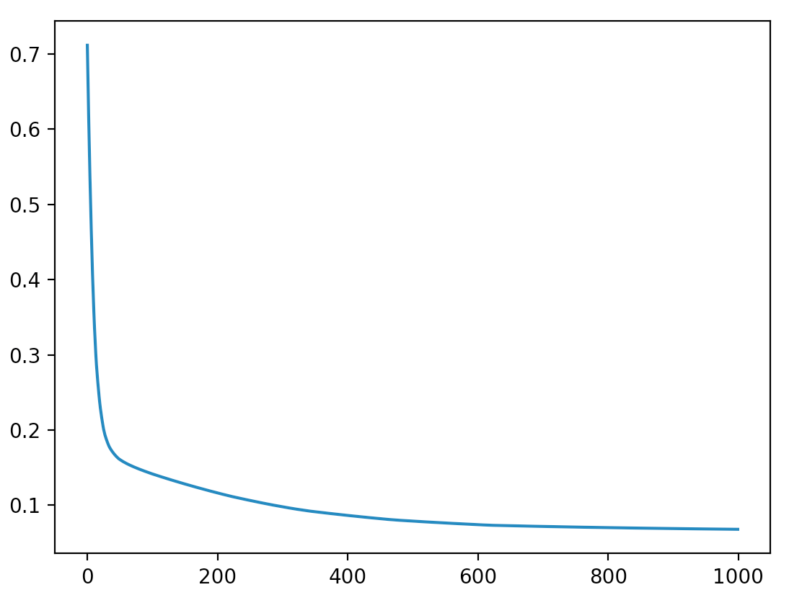
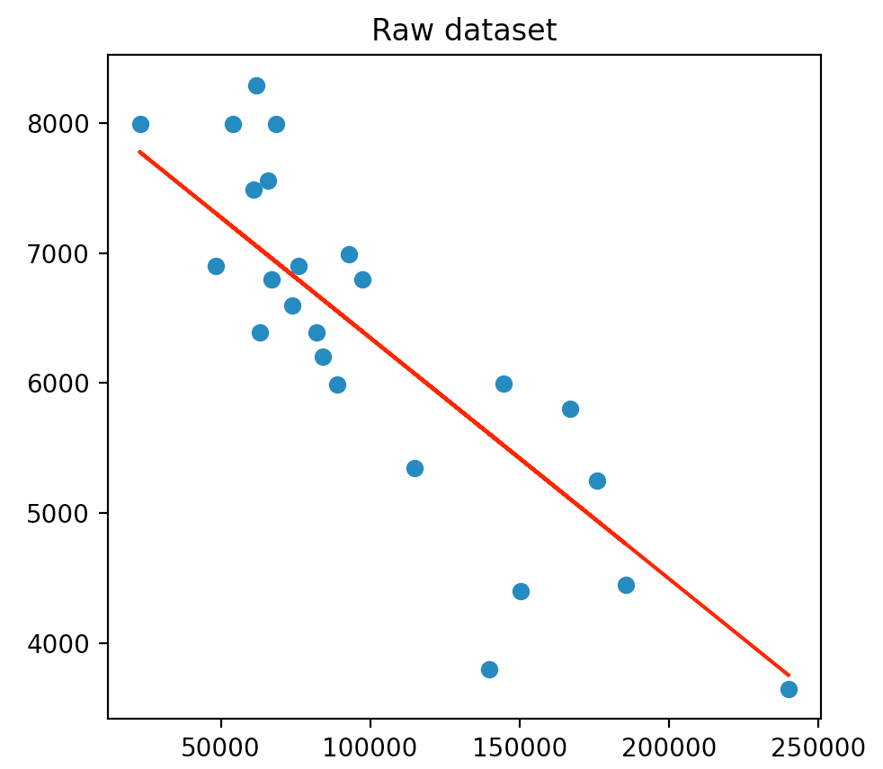

# ft_linear_regression

## Goal of the project

The goal of the project is to train a program to guess the price of a car given its kilometrage. It's a simple linear regression problem.

## What's linear regression ?


Linear regression is the process of finding a line that best fits a given dataset.

It can be done with the gradient descent algorithm. You can define "finding the line that best fits M examples" by "**find the line that reduces the average distance between the examples and itself**". Gradient descent is an algorithm that look at every examples, and adjust the line a little bit to fit better.

To speed up the process of learning, you can group your training examples in batch.

**Features** are the input, here the kilometrage, **targets** are the output, here the price.

**Bias** is a trainable parameter that **doesn't depend on the inputs**. Here it's theta0.

Basically, the algorithm is:

```
for every epochs:
	for every batch:
		predictions = our prediction for given features
		error = difference between our prediction and targets
		for every weight:
			delta[weight] = learning_rate * error * features[i]
		delta_bias = learning_rate * error
		weights = weights - delta
		bias = bias - delta_bias
```


## Project walkthrough

### Get a visual representation of the given dataset

You can use pyplot to visualize data in Python. Here we have a 2D dataset, so we use the scatter function. Here is what we get:

We can see that the axis have a really different scale. So what we can do is normalizing our data, to constrain every example between 0 and 1 on both axis. So now we have:

### Fit our line

Our line is defined by two parameters, theta0 and theta1:

```
price = theta0 + theta1 * kilometrage
```

Now we use the gradient descent algorithm to find the best parameters.

Here what's the training looks like on my side, **with 1000 epochs and a batch size of 4**:

At the end of the training, I have:

```
theta0 = 8199.8729
theta1 = -0.0185
```

**If you scaled your dataset, don't forget to scale back your parameters !**

### Plot our line and make predictions

We now have our line that minimizes the average distance with examples. We can plot it on our dataset to see if our values seem correct: 

The line seems good, and now we can do predictions by reading on the line, or by using the formula given previously.